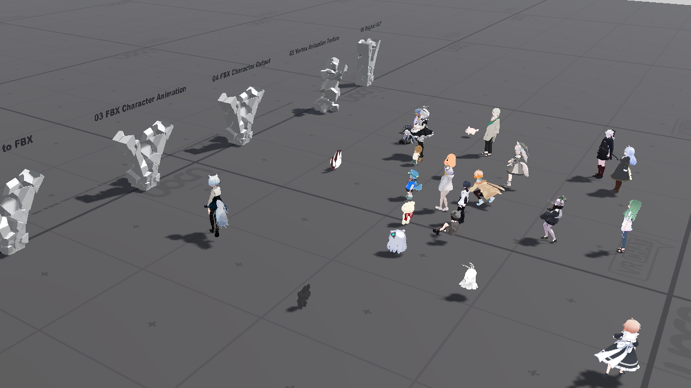
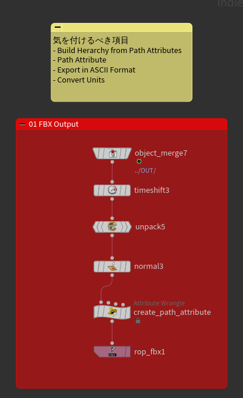
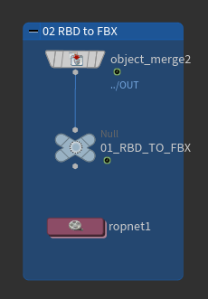
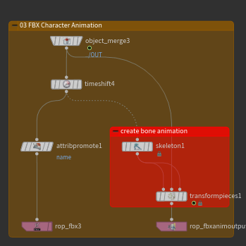
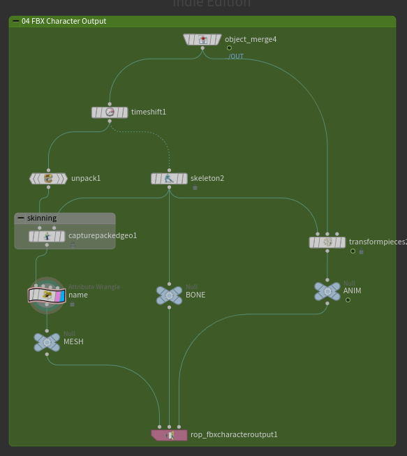
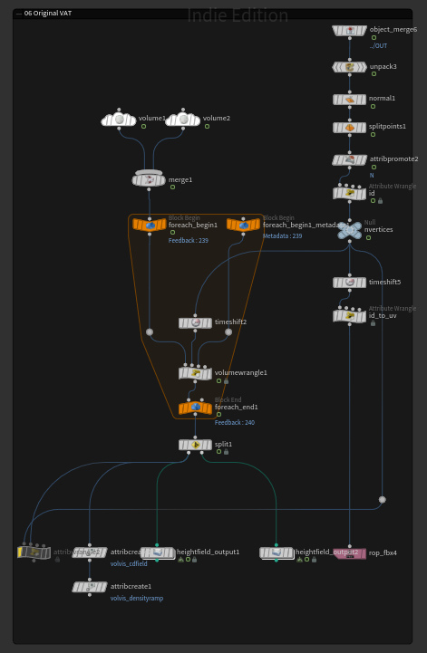

# VRC Houdini 勉強会 No.76
 

- 2024年1月7日に行われたVRC Houdini勉強会No.76の発表のアウトラインとサンプル
- テーマ「初心者大歓迎」
- FBXを使ったメッシュアニメーションの書き出しの方法を紹介した

## 0.シミュレーションのセットアップ
- RBD Bullet Solverを使った破壊シミュレーション
- RBD Bullet Solverのサンプル例をもとに調整
- ノードを右クリック -> Helpからノードのドキュメントを開ける
- ExamplesのLoadを押すことで現在のhipファイル内にサンプルノードを置いてくれる
## 1.FBX Output
     
[FBX Output](https://www.sidefx.com/ja/docs/houdini/nodes/top/ropfbx.html)を使った静的なFBXの書き出し   
幾つかの注意点がある
#### Path Attribute
- primitiveにpath attributeを設定することでサブメッシュに分割される
#### Convert Unit
- Convet UnitはHoudini / UnityどちらもOffを推奨
#### Export in ASCII Format
- Blenderはバイナリ形式のFBXしか読み込めないのでなるべくオフにする
## 2.RBD to FBX
     
[Labs RBD to FBX](https://www.sidefx.com/ja/docs/houdini/nodes/out/labs--rbd_to_fbx-2.0.html)を使用するケース  
- これが一番手軽
- 'RBD'というノード名だが、パックプリミティブに汎用的に使える
- パックプリミティブの出力自体はFBX Outputにもともと備わっている機能
## 3.FBX Character Animation
    
[FBX Animation Output](https://www.sidefx.com/ja/docs/houdini/nodes/sop/kinefx--rop_fbxanimoutput.html)を使用するケース  
- RBD to FBXではアニメーションとメッシュが同じFBXで出力される  
- FBX Animation Outputを使用してメッシュFBXと階層構造が一致するボーンアニメーションを書き出すことでメッシュとアニメーションのファイルを分離できる
- ボーンアニメーションへの変換はSkelton SOP -> Transform Pieces SOP
## 4.FBX Character Output
   
[FBX Character Output](https://www.sidefx.com/ja/docs/houdini/nodes/sop/kinefx--rop_fbxcharacteroutput.html)を使用するケース
- 3の方法に加えてスキニングをする
- 2・3の方法だと各ピースごとに別々のサブメッシュにする必要があるが、対応するピースのウェイトが塗られた単一のスキンドメッシュにすることでレンダリング時の負荷を抑えられる
- スキニングはCapture Packed Geometry SOPを使用。`Pack Input`と`Unpack Output`を両方オンにする
- 単一のGameObjectになるのでUnity側での手動 or スクリプトでの各ピースのオンオフの切り替えができなくなる
## 5.Vertex Animation Texture
   
[Vertex Animation Texture](https://www.sidefx.com/ja/docs/houdini/nodes/out/labs--vertex_animation_textures-3.0.html)を使用したVATの書き出し
- 上手くいっていない
- 何をしたのかを紹介
- UnityプロジェクトにShader Graphをインポート
- SideFXLabsに含まれるURP_VAT3をプロジェクトに追加
    - Package Installatin Guide.txtにはパッケージとして読み込む方法がかいてあるが今回は直接AssetsにD&D
- 各ShaderのGraph InspectorからTarget SettingにBuild-inを追加
## 6.Original VAT
   
VATのテクスチャの書き出しとシェーダーをそれぞれ自作するケース
- 頂点数xフレーム数の解像度の2D Volumeを用意して、ForLoop+TimeShiftで各フレームごとの値をテクセルに書き込む
- テクスチャの出力はOutput HeightFieldを使用